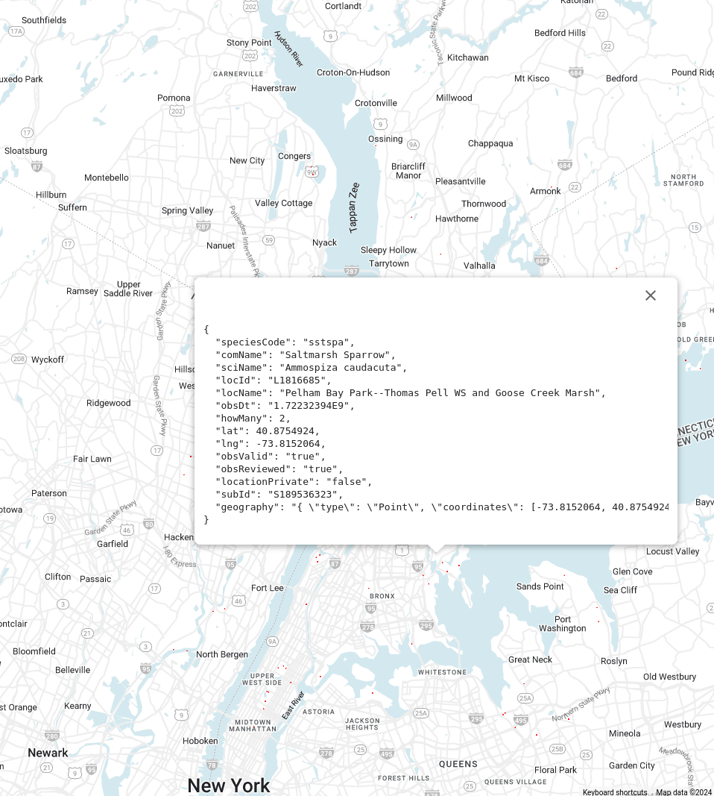

# Project Bird on GCP (In Progress)
GCP ETL project to pull data from eBird API 2.0 and display a map of recent bird observations in a given area

## Goals for this project
- Step 1: Schedule an Airflow job to pull data from eBird API 2.0 and store it in Cloud Storage -> Done
- Step 2: Clean the data via an Apache Beam Dataflow job and push the results to BigQuery -> Done
- Step 3: Use a Cloud function to trigger the Dataflow job in Step 2 on file upload to Cloud Storage bucket -> Done
- Step 4: Display the results with BigQuery Geo Viz

